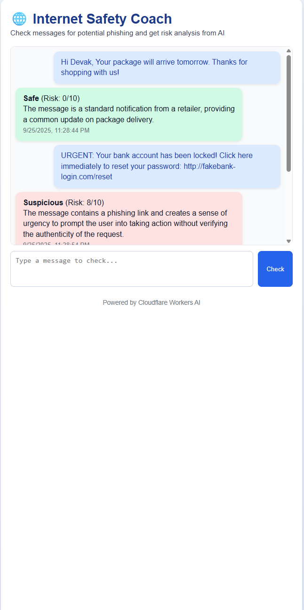

# cf_ai_internet_safety_coach

An **AI-powered Internet Safety Coach** built on **Cloudflare Workers AI**.  
Users can paste suspicious emails, texts, or messages into the app, and the AI will classify them as **Safe / Suspicious**, explain why, and remember past checks for context.

## Frontend Preview


---

## 🚀 Features
- **LLM-powered classification** using **Llama 3.3** on Workers AI.
- **Workflow orchestration** with Cloudflare Workers (optionally Workflows).
- **Memory/state** stored in KV or Durable Objects to track a user’s last few checks.
- **Simple chat-like UI** hosted on Cloudflare Pages for user interaction.
- **PROMPTS.md** included for AI coding transparency.

---

## 🏗 Architecture
1. **Frontend (Cloudflare Pages)**  
   A simple web chat UI where users paste messages.
2. **Cloudflare Worker**  
   Accepts input, queries Llama 3.3, classifies as Safe/Suspicious, and explains reasoning.
3. **Memory Layer (KV/Durable Object)**  
   Remembers recent user submissions and AI responses.
4. **Workflow**  
   Optionally chains steps (classification → explanation → risk scoring).

---

## 📦 Running Locally
Make sure you have [Wrangler](https://developers.cloudflare.com/workers/wrangler/) installed.

```bash
npm install
npx wrangler dev

---

##  🧪 Example Usage
User pastes:

"Your account has been locked! Click here to reset: http://phishy-link.biz
"

AI responds:
Suspicious (Risk Level: 9/10)
Reason: Contains urgent tone, suspicious domain, and phishing-like reset request.